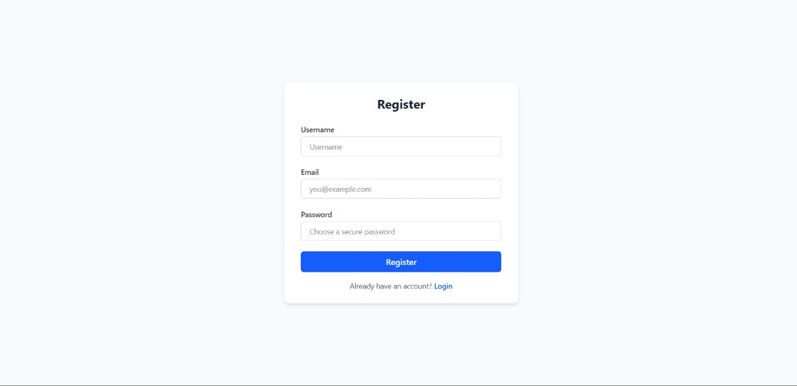
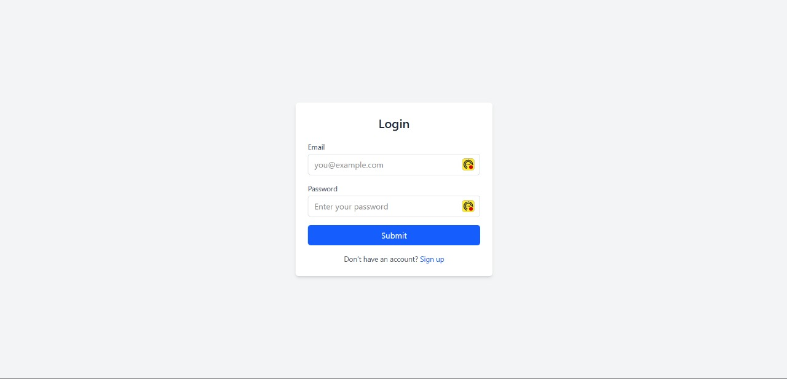
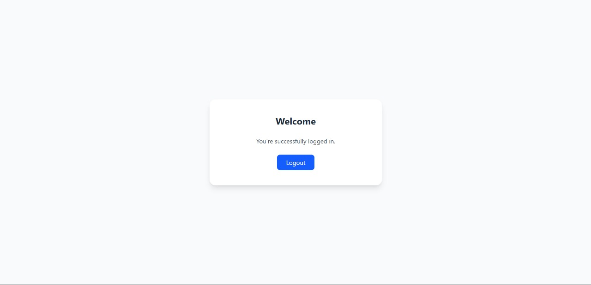

# 🔐 Secure User Authentication System

This is Task-01 of the **Prodigy Infotech Web Development Internship**, where we built a **Secure User Authentication System** using React, Tailwind CSS, JavaScript, Node.js, Express.js, and MySQL (no MongoDB).

## 📌 Project Features

- 📝 User Registration
- 🔐 Secure Login with hashed passwords
- 🧠 Session Handling using Express-Session
- 🚫 Error Handling and Validation
- 📁 MySQL Database Integration
- 🖥️ Clean and Responsive UI

---

## 📂 Tech Stack

| Frontend | Backend | Database | Others         |
|----------|---------|----------|----------------|
| REACT    | Node.js | MySQL    | Express.js     |
| Tailwind CSS      | Express |          | bcryptjs       |
| JavaScript |       |          | express-session|

---

## 🖼️ Screenshots

 
 
 

---

## 🛠️ Installation & Setup

### Prerequisites

- Node.js & npm
- MySQL server

### 1. Clone the Repo

```bash
git clone https://github.com/vira250/PRODIGY_FS_01.git
cd PRODIGY_FS_01
```
### 2. Install Dependencies
```bash
npm install
```

### 3. Setup MySQL Database
```bash
CREATE TABLE users (
  id INT AUTO_INCREMENT PRIMARY KEY,
  username VARCHAR(100),
  email VARCHAR(100) UNIQUE,
  password VARCHAR(255),
  role ENUM('user', 'admin') DEFAULT 'user'
);

```

### 4. Configure DB Connection
```bash
const db = mysql.createConnection({
  host: 'localhost',
  user: 'your_username',
  password: 'your_password',
  database: 'auth_system'
});
```
### 5. Run the Application
```bash

node index.js
```

## 🔐 Authentication Flow
Register: User signs up with username, email, and password.

Login: Credentials are checked, session is stored.

Dashboard: Role-based redirection (user/admin).

Logout: Session is destroyed securely.
